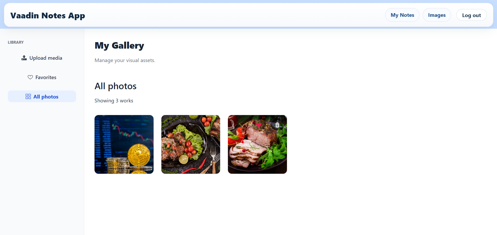
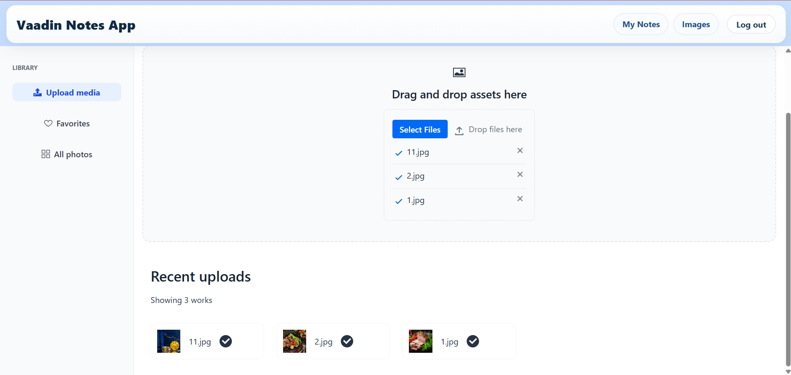
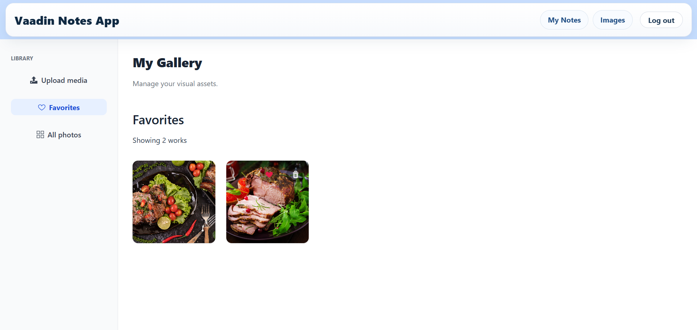

# Image Gallery Feature - Shyni Atapattu

## Project Overview
This feature was developed as part of the Sundevs Technical Assignment (Phase 2, Option A). It introduces a robust Image Gallery system into the Vaadin-based Notes application, allowing users to securely upload, manage, and favorite visual assets.

---

## Key Features

### Secure Multi-Format Upload
Supports `.png`, `.jpg`, `.jpeg`, `.gif`, and `.webp` with automatic file-type validation.

### Responsive Grid Interface
A modern gallery view built with CSS Grid that automatically adjusts its layout for desktop and mobile screens.

### Interactive Drag-and-Drop
Users can physically reorder images within the gallery by dragging and dropping them into new positions, providing a personalized organization experience.

### Intelligent Empty States 
Implemented context-aware empty states that provide clear instructions to the user when no images or favorites are present, improving the initial "onboarding" experience.

### Favorites & Discovery
A "Heart" toggle system that allows users to mark important assets and filter the gallery instantly using Java Streams.

### Resource Management
A "Disk-First" deletion protocol that cleans up physical files before database records to prevent "Orphan File" accumulation.

## Screenshots

### Gallery View


### Upload Feature


### Favorites Filter


---

## Technical Architecture

### 1. Data Layer (com.example.notes.data.entity.Image)
- **Metadata Storage:** Stores essential metadata (file name, local path, favorite status) in the database while keeping binary data on the disk.
- **User Isolation:** Implements a relationship with the User entity to ensure images are private and only accessible to the owner.

### 2. Service Layer (com.example.notes.service.ImageService)
- **Collision Prevention:** Every file is renamed using a unique identifier (UUID) before storage to ensure files do not overwrite each other.
- **Robust I/O:** Uses modern Java file APIs (`java.nio.file`) for efficient operations and includes comprehensive error handling.

### 3. UI Layer (com.example.notes.views.ImageView)
- **Componentized Design:** The UI is broken into smaller, reusable custom Vaadin components for better maintainability.
- **Secure Streaming:** Uses `StreamResource` to pipe image bytes directly to the browser, displaying images without exposing the server’s internal file structure.
- **Polished UX:** Implements hover-activated action buttons for a professional, intuitive user experience.

---

## Setup & Detailed Configuration

### 1. Prerequisites
- JDK 17+
- Maven
- IDE (VS Code or IntelliJ IDEA)

---

### 2. Database Setup
The application uses H2. Update your `schema.sql` (located in `src/main/resources/`) with:

```sql
ALTER TABLE image ADD COLUMN IF NOT EXISTS favorite BOOLEAN DEFAULT FALSE;
### 3. Physical Storage
Files are stored in: uploads/images/ (project root)
The ImageService automatically creates this directory if it does not exist
Ensure the application has write permissions

### 4. Running the Feature
-Checkout your feature branch
git checkout feature-image-upload

-Build the project
mvn clean install

-Run the application
Execute NotesApplication.java from your IDE

-Open in browser
http://localhost:8080/